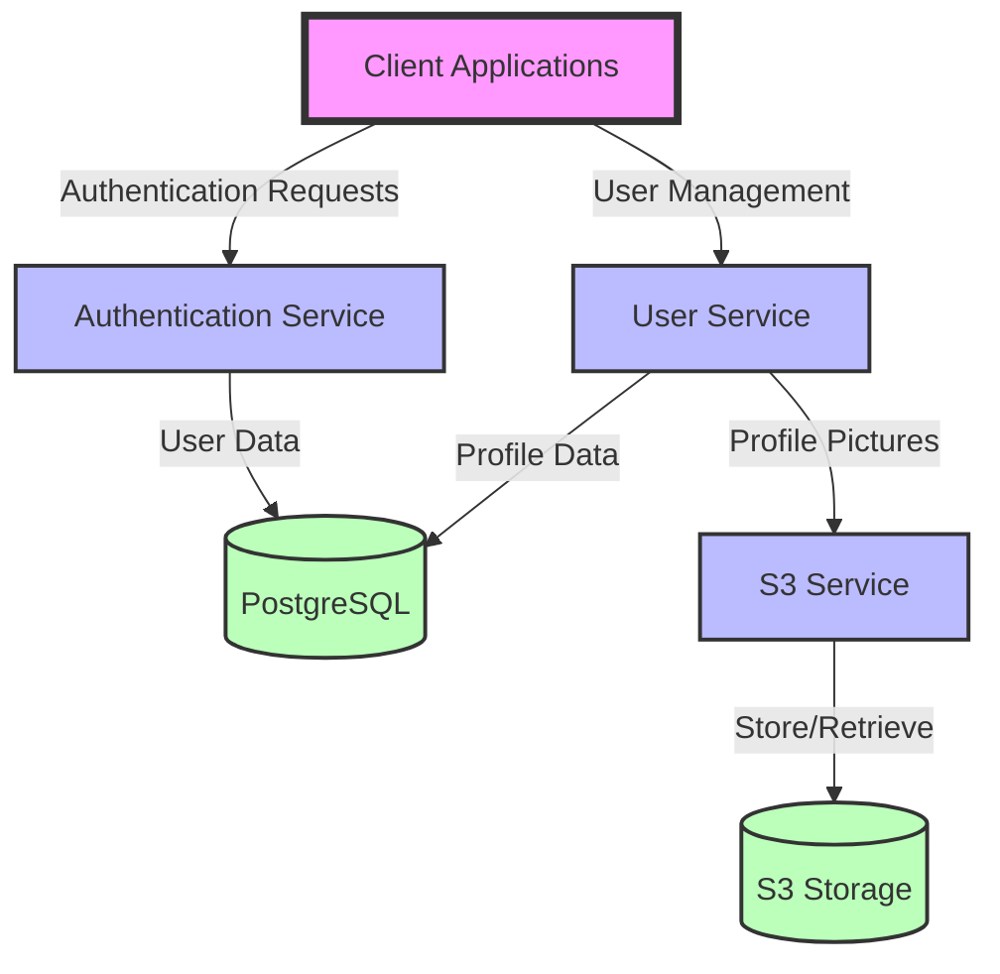
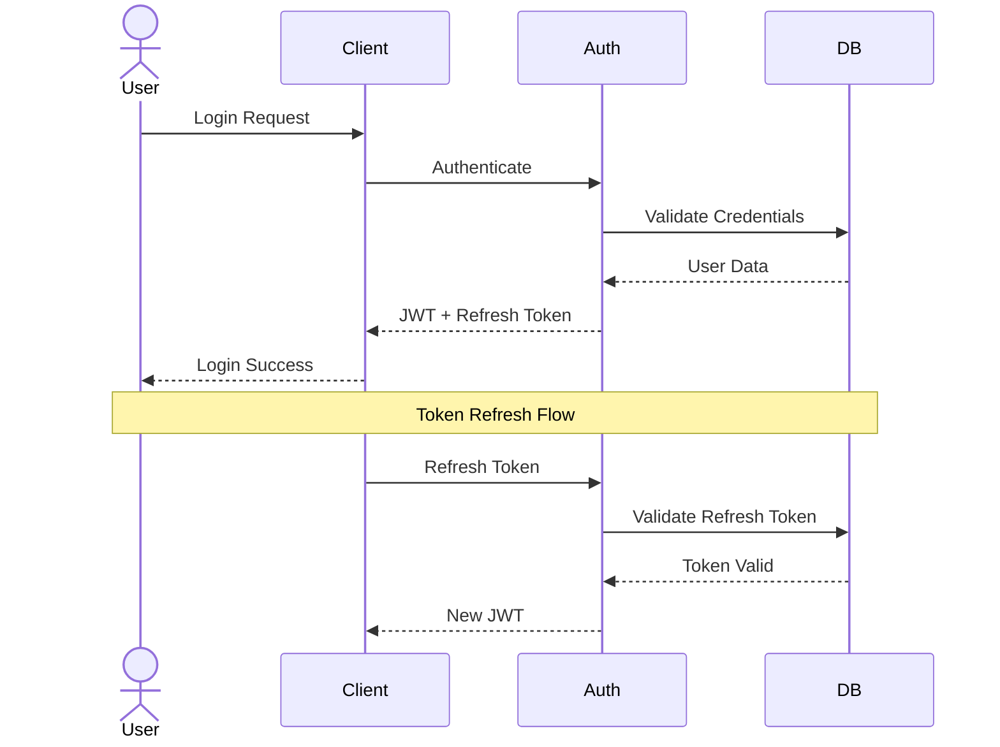

[](https://github.com/sandeepkv93/user-management-springboot/actions/workflows/ci.yml)
[](https://codecov.io/gh/sandeepkv93/user-management-springboot)

# 🔐 User Management Service

A powerful Spring Boot application for managing users with OAuth2 social login and AWS S3 integration! 🚀

## ✨ Features

### 🎯 Core Features
- 🔑 JWT Authentication & Authorization
- 🌍 OAuth2 Social Login (Google & GitHub)
- 👤 User Profile Management
- 🖼️ Profile Picture Storage (AWS S3)
- 📊 Role-Based Access Control
- 🔄 Token Refresh Mechanism

### 🛠️ Technical Stack
- ☕ Java 21
- 🍃 Spring Boot 3.2
- 🐘 PostgreSQL 16
- 🐳 Docker & Docker Compose
- 📦 LocalStack (S3 Emulation)
- ✈️ Flyway Migrations

## 🏗️ Architecture



### 🔄 Authentication Flow



## 🚀 Getting Started

### 📋 Prerequisites
- ☕ Java 21
- 📦 Maven
- 🐳 Docker & Docker Compose
- 🐘 PostgreSQL 16
- 💻 Your favorite IDE!

### 🔧 Setup

1. **📥 Clone the Repository**
```bash
git clone <repository-url>
cd user-management
```

2. **🐳 Start Infrastructure**
```bash
docker-compose up -d
```

3. **🎯 Initialize S3**
```bash
chmod +x scripts/init-localstack.sh
./scripts/init-localstack.sh
```

4. **⚙️ Configure Application**

Create `application.yml` with your settings:
```yaml
spring:
  datasource:
    url: jdbc:postgresql://localhost:5432/user_management
    username: user
    password: password

app:
  jwt:
    secret: ${JWT_SECRET:your-secret-key}
  aws:
    s3:
      bucket-name: user-profiles
```

5. **🚀 Build & Run**
```bash
mvn clean install
mvn spring-boot:run
```

## 🔌 API Reference

### 🔐 Authentication

#### 📝 Register
```http
POST /api/auth/signup
{
  "username": "cooluser123",
  "email": "cool@example.com",
  "password": "secure123!"
}
```

#### 🔑 Login
```http
POST /api/auth/login
{
  "email": "cool@example.com",
  "password": "secure123!"
}
```

### 👤 User Management

#### 📱 Get Profile
```http
GET /api/users/me
Authorization: Bearer <your-jwt-token>
```

#### 🖼️ Update Profile Picture
```http
POST /api/users/me/profile-picture
Authorization: Bearer <your-jwt-token>
Content-Type: multipart/form-data
```

### 🌐 OAuth2 Login

#### 🔷 Google
```http
GET /oauth2/authorization/google
```

#### 🐱 GitHub
```http
GET /oauth2/authorization/github
```

## 🔒 Security Features

### 🔐 Authentication
- 🎟️ JWT Tokens (1 hour validity)
- 🔄 Refresh Tokens (30 days validity)
- 🔒 BCrypt Password Encryption

### 👮 Authorization
- 👥 Role-Based Access Control
- 🛡️ Method-Level Security
- 🚫 CORS Protection

## 🧪 Testing

```bash
# 🧪 Run all tests
mvn test

# 📊 Generate coverage report
mvn verify
```

## 🔧 Development

### 📝 Code Style
```bash
# 🎨 Format code
mvn com.spotify.fmt:fmt-maven-plugin:format
```

### 📚 Database Migrations
```bash
# 🔄 Run migrations manually
mvn flyway:migrate
```
