# 🌐 Understanding OAuth 2.0 and OpenID Connect: The Interactive Guide

Hey there! If you're diving into **OAuth 2.0** and **OpenID Connect (OIDC)**, you're probably wondering about all these tokens, flows, and security best practices. Let's break it down together in an easy-to-follow, interactive way. 🤓

## 🏆 Key Concepts Recap: OAuth 2.0 and OIDC

Let's kick things off with the basics!

### 🎟 OAuth 2.0 - The Authorization Framework

**OAuth 2.0** is an **authorization framework**. It allows you to control what each app or service can access — like, for instance, an app accessing your photos but *not* your emails. With OAuth, we define **limited access** without revealing our **username and password** to third-party applications.

### 🔐 OpenID Connect - Adding Authentication to the Mix

**OIDC** is a **layer on top of OAuth 2.0** that adds **authentication** so that we can uniquely identify the user (or service). While OAuth 2.0 is about **authorization** (what you’re allowed to access), **authentication** is about **confirming who you are**.

Here's a quick summary:

- **Authentication**: "Who are you?" 🕵️‍♂️
- **Authorization**: "What are you allowed to do?" 🔐

---

## 🚀 How the Flow Works

The **Authorization Code Flow** is commonly used in **OAuth 2.0** and **OIDC** for web apps to securely handle tokens. Here’s the main process:

1. **User initiates login** 🧑‍💻.
2. **Authorization Server** provides a one-time **authorization code**.
3. **App Backend** exchanges this code for **access tokens** (and a **refresh token** if OIDC is used).
4. **Access Token** allows limited resource access. **Refresh Token** is for getting a new access token after expiration.

### 🌐 High-Level Flow Diagram

Here’s how it looks in a diagram. Follow along! 👇

```mermaid
sequenceDiagram
    participant User as 👤 User
    participant Browser as 🌍 Browser
    participant AuthServer as 🔐 Authorization Server
    participant Backend as 🖥 App Backend
    participant Resource as 📄 Resource Server

    User ->> Browser: 1. Log In
    Browser ->> AuthServer: 2. Authorization Request
    AuthServer ->> Browser: 3. Authorization Code
    Browser ->> Backend: 4. Send Authorization Code
    Backend ->> AuthServer: 5. Exchange Code for Tokens
    AuthServer ->> Backend: 6. Access Token & Refresh Token
    Backend ->> Resource: 7. Access Protected Resources
    Resource ->> Backend: 8. Return Resources
    Backend ->> Browser: 9. Display Resources
```

### 📝 Step-by-Step Breakdown

Let’s walk through each step in more detail. 😎

1. **User Logs In**: The user initiates the login process in the app.
2. **Authorization Request**: The browser sends a request to the **Authorization Server** asking for access, including the app's unique identifier.
3. **Authorization Code**: The **Authorization Server** sends a **short-lived authorization code** back to the **browser**.
4. **Authorization Code to Backend**: The browser securely forwards this **authorization code** to the app's **backend**.
5. **Backend Exchanges Code**: The **backend** uses the authorization code to request an **access token** and **refresh token** from the **Authorization Server**.
6. **Tokens Received**: The **Authorization Server** responds with an **access token** and **refresh token**.
7. **Resource Access**: The **backend** uses the **access token** to request resources from the **Resource Server**.
8. **Resources Returned**: The **Resource Server** sends back the requested resources to the **backend**.
9. **Display Resources**: The **backend** displays the resources in the **browser** for the user.

---

## 🛠 Where to Store Tokens: Access vs. Refresh

Now let's address where these tokens should live to stay secure. 🔒

### 🏷 Access Token Storage

The **access token** can be stored in a **secure, HTTP-only cookie**. This way:

- **HTTP-only cookies** can’t be accessed by JavaScript, making it safer from **XSS attacks**.
- It’s sent automatically in each HTTP request to the backend.

### 📥 Refresh Token Storage

The **refresh token** should **never** be stored in the browser directly due to its long lifespan and higher security risks. Instead:

- The **refresh token** should be stored on the **server-side** where it’s secure and inaccessible to client-side scripts.

---

## 🔄 Why Do We Even Need Refresh Tokens?

You might be wondering, “Why not just keep using the **authorization code** to get new access tokens?” 🤔

Here’s the thing:

- **Authorization Code** is a **one-time use** code, and once it’s exchanged for an **access token**, it’s no longer valid.
- **Access Tokens** expire quickly (usually in minutes or an hour) to reduce risk if compromised.
- The **refresh token** is designed for **longer-term use** and can issue new access tokens without requiring the user to log in again.

This way, **refresh tokens** provide a balance between security and convenience, allowing **silent re-authentication** without user interruption.

---

## ❓ But What If the Refresh Token Gets Compromised?

Great question! 🤔 Since refresh tokens are long-lived, if someone steals a refresh token, they could potentially keep generating access tokens indefinitely. Here’s how systems address this:

### 🛡 Security Measures for Refresh Tokens

1. **Shorter Lifespans**: By limiting the lifetime of refresh tokens, the window for misuse is reduced.
2. **Revocation Mechanism**: The Authorization Server can revoke refresh tokens if it detects unusual behavior (e.g., multiple requests from different IPs).
3. **Access Control**: Use additional checks, like device or IP, to make refresh token use more secure.
4. **Use of MFA**: Some high-security systems add a second authentication factor to further protect the refresh token.

### 🔄 How Does It Look?

```mermaid
sequenceDiagram
    participant Backend as 🖥 Backend
    participant AuthServer as 🔐 Authorization Server

    Backend ->> AuthServer: Request New Access Token using Refresh Token
    AuthServer -->> Backend: New Access Token
    Note right of AuthServer: If suspicious, revoke Refresh Token

```

---

## 🌟 Summary

Let’s wrap it up with a quick summary:

- **OAuth 2.0** = Authorization (what can the user do?)
- **OIDC** = Authentication (who is the user?)
- **Access Token** = Short-lived, stored in a secure HTTP-only cookie on the client.
- **Refresh Token** = Long-lived, stored on the server, used to get new access tokens.

By securely handling these tokens, we ensure that user data is accessible only to authorized clients and actions. 🔐
